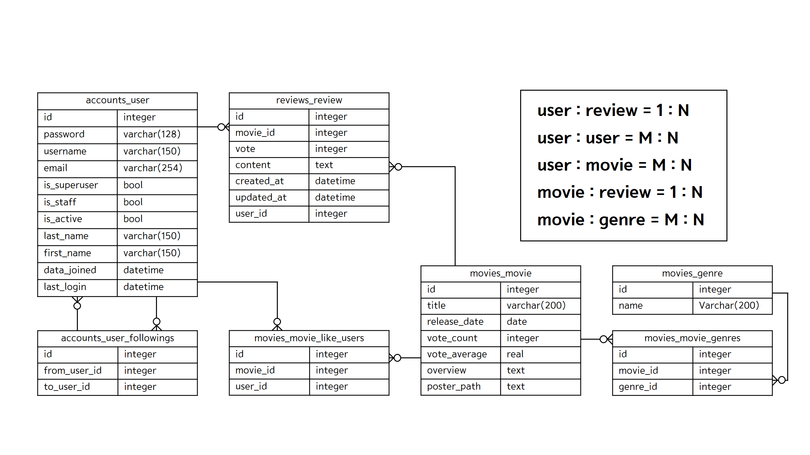

# 🎬WEFLIX

내가 좋아하는 영화

당신이 좋아하는 영화

##### 우리가 함께 즐기는 영화

------------------------------

# 0. 시작하기

- 개발환경
  - Django 3.2.12
  - Vue

- BACK-END

```python
$ cd final-pjt-back
$ python -m venv venv
$ source venv/Scripts/activate
$ pip install -r requirements.txt
$ python manage.py migrate
$ python manage.py loaddata user.json genre.json movie.json review.json
$ python manage.py runserver
```

- FRONT-END

```python
$ cd final-pjt-front
$ npm install
$ npm run serve
```

- 등록된 유저 정보
  - admin
    - admin
  - jisu
    - xptmxmdlqslek(테스트입니다)
  - taesam
    - xptmxmdlqslek(테스트입니다)


------------------------------------

# 1. BACK-END


# 1-1. ERD




# 1-2. 관리자 뷰

- 관리자는 사용자와 영화, 리뷰에 대해 생성, 조회, 수정, 삭제가 모두 가능합니다.

- 관리자만 영화 정보를 등록, 수정, 삭제할 수 있습니다.

- 관리자만 다른 유저의 정보를 수정하거나 삭제할 수 있습니다.


# 1-3. 초기 영화 데이터 생성

- `data/genre.py`
- `data/popularmovie.py`
- [TMDB](https://www.themoviedb.org/?language=ko) API를 이용하여 1000개의 인기 영화를 초기 데이터로 사용했습니다. 
- 응답 예시 `api/v1/movies/movie_pk/`

```python
{
    "model": "movies.movie",
    "pk": 862,
    "fields": {
        "title": "토이 스토리",
        "overview": "카우보이 인형 우디는 꼬마 주인인 앤디의 가장 사랑받는 장난감이다. 그러나 어느날 버즈라는 새로운 장난감이 등장한다.  버즈는 최신형 장난감으로 레이저 빔 등의 첨단장비를 갖추고 있으나, 버즈는 자신이 장난감임을 인식하지 못하고 자신이 우주에서 온 전사이며 자신이 갖춘 장비로 하늘을 날 수 있다고 믿고 있다. 버즈의 허상을 상처받지 않고 인식시켜 주려는 우디와 친구들. 그러나 뜻밖의 사고가 일어난다. 옆집 개에게 버즈가 납치당하고 이런 버즈를 구하기 위해 우디와 친구들은 구조대를 조직해 버즈를 구하러 가는데...",
        "poster_path": "/9XFrhkHRYw3AmCZwQX4G2gOwVB0.jpg",
        "release_date": "1995-12-30",
        "vote_count": 15382,
        "vote_average": 8.0,
        "genres": [
            12,
            16,
            35,
            10751
        ],
        "like_users": []
    }
}
```


# 1-4. 영화 추천 알고리즘

- FOR ANYONE

  - RANDOM RECOMMEND
    - 기본적으로 제공하는 영화 추천입니다.
    - 인기 영화들 중 랜덤으로 12개를 선택하여 보여줍니다.

  - WORLDCUP PREFERENCE
    - 이상형 월드컵 방식을 이용한 영화 추천입니다.
    - 인기 영화들 중 랜덤으로 16개를 추출하여 2개씩 묶어 보여주고, 유저는 둘 중 하나를 선택합니다.
    - 마지막 1개가 남을 때까지 선택을 반복하고, 최후의 영화에 대한 자세한 정보를 제공합니다.


- FOR ME
  - GENRE PREFERENCE via REVIEWS
    - 리뷰를 작성한 로그인 유저를 위한 영화 추천입니다.
    - 유저가 작성한 별점 3점 이상의 리뷰에 해당하는 장르들 중 가장 많은 장르 1~2위 추출합니다.
    - 해당 장르의 영화들 중 평점 별점 3점 이상의 영화들을 중복 없이 추천합니다.


- FOR WE
  - LIKE PREFERENCE via FOLLOWS
    - 맞팔로우 유저가 존재하는 로그인 유저를 위한 영화 추천입니다.
    - 맞팔로우 유저들이 좋아요를 누른 영화들을 추천합니다.
    - 여러 명의 유저들이 같은 영화에 대해 좋아요를 눌러도 중복없이 한 번만 보여집니다.


------------------

# 2. FRONT-END


--------------------

# 3. 느낀점