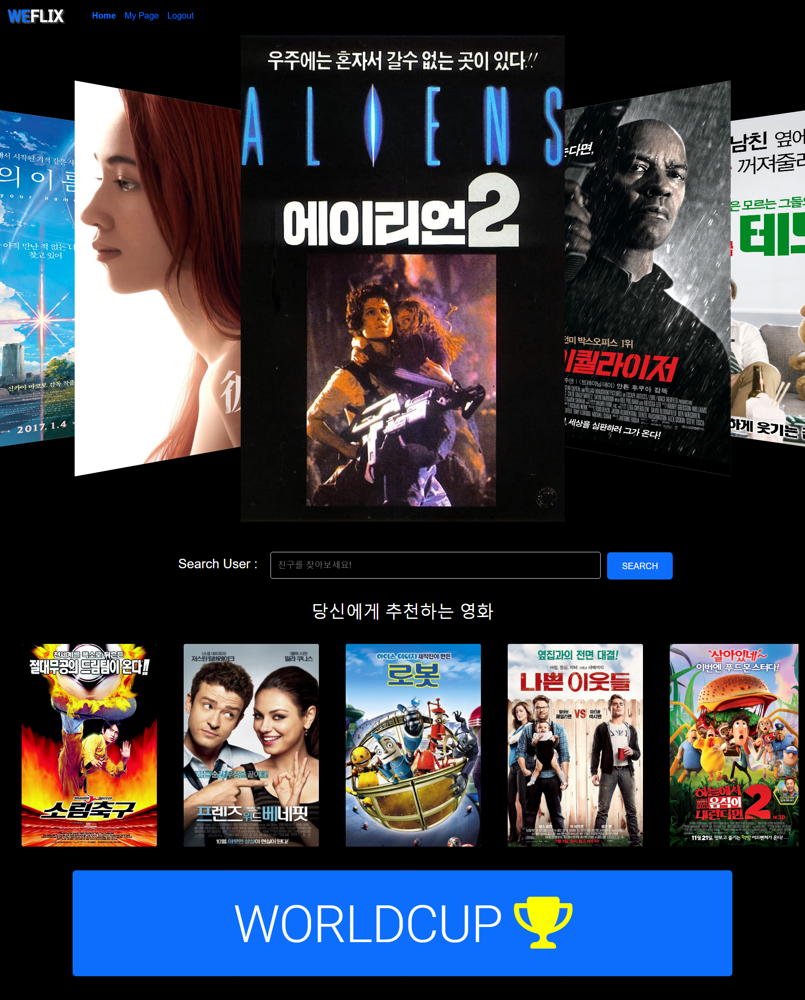
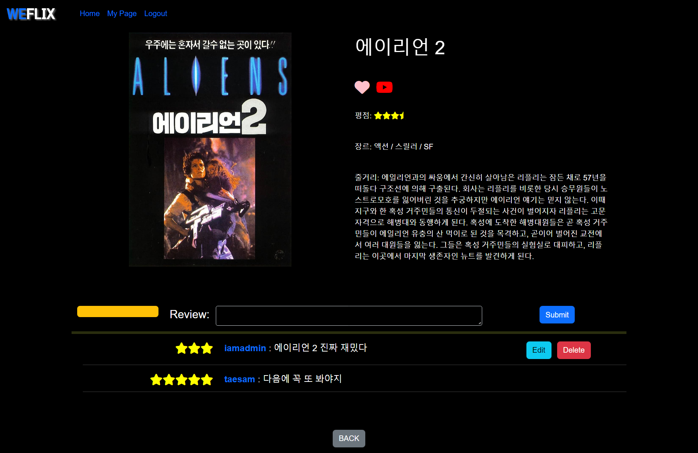
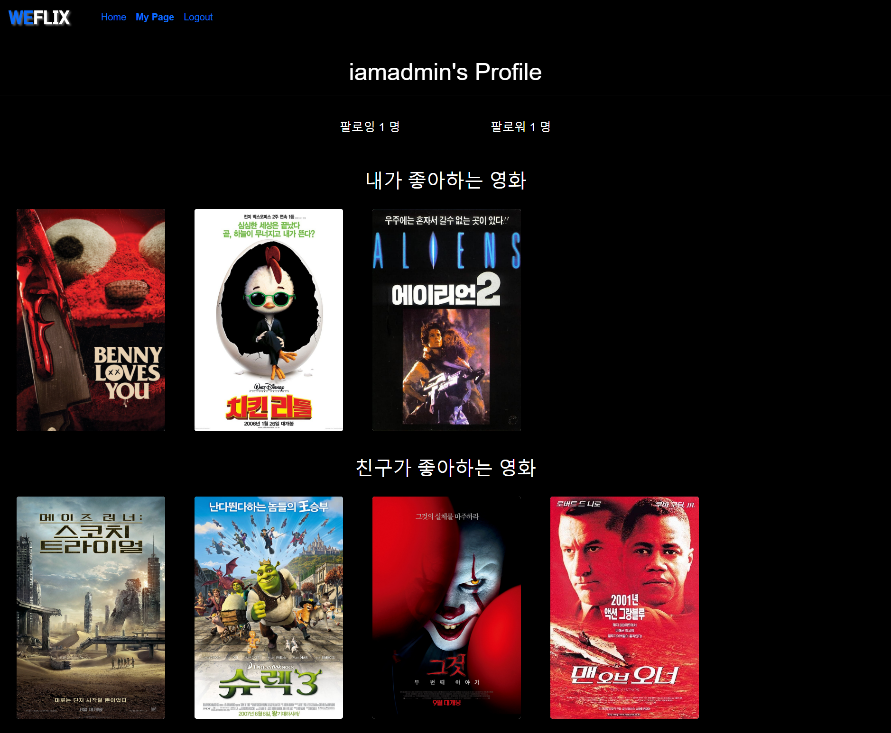
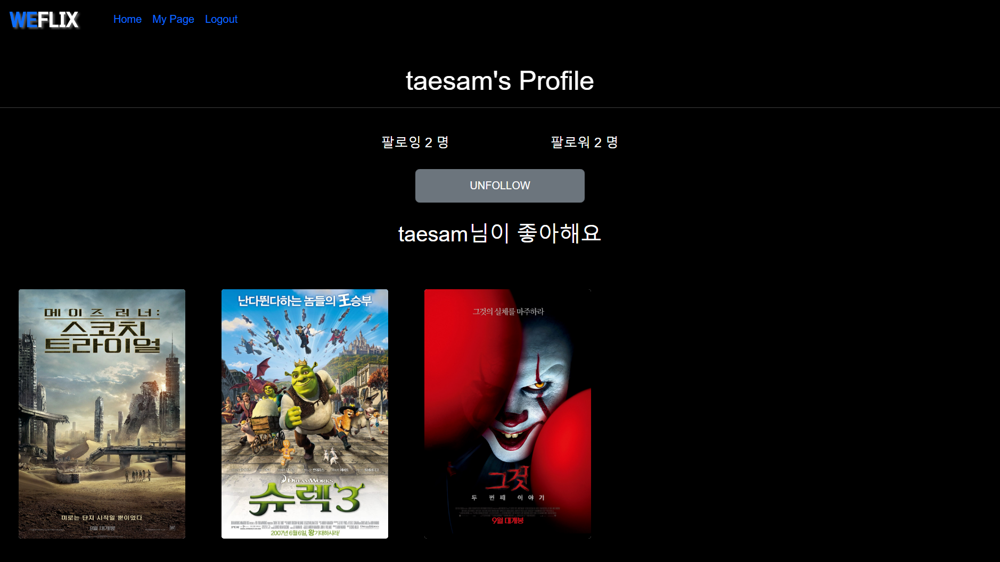
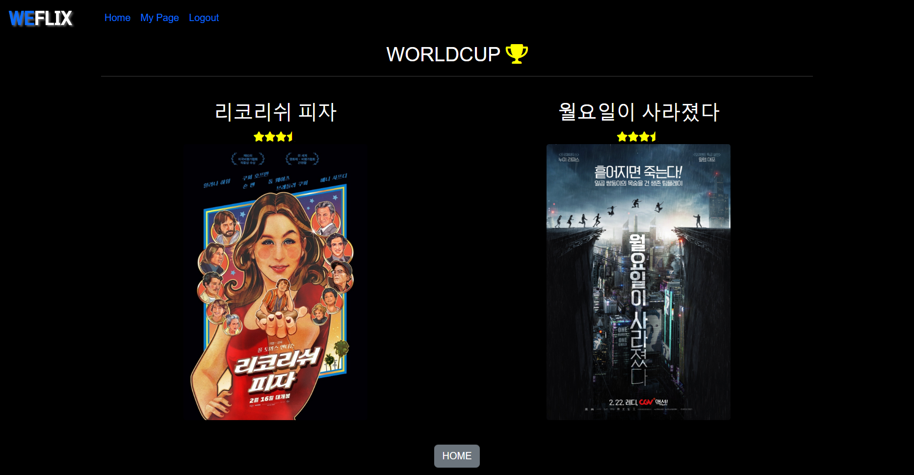
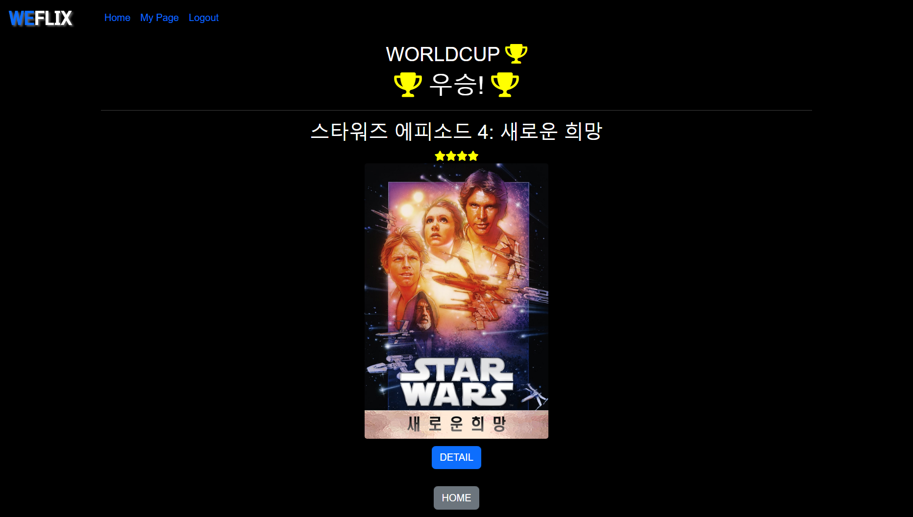

# 🎬WEFLIX

내가 좋아하는 영화

당신이 좋아하는 영화

##### 우리가 함께 즐기는 영화

------------------------------

# 0. 시작하기

- 개발환경
  - Django 3.2.12
  - Vue.js 2

- BACK-END

```python
$ cd final-pjt-back
$ python -m venv venv
$ source venv/Scripts/activate
$ pip install -r requirements.txt
$ python manage.py migrate
$ python manage.py loaddata user.json genre.json movie.json review.json
$ python manage.py runserver
```

- FRONT-END

```python
$ cd final-pjt-front
$ npm install
$ npm run serve
```

- 등록된 유저 정보
  - admin
    - admin
  - jisu
    - xptmxmdlqslek(테스트입니다)
  - taesam
    - xptmxmdlqslek(테스트입니다)


------------------------------------

# 1. BACK-END


# 1-1. ERD


# 1-2. 관리자 뷰

- 관리자는 사용자와 영화, 리뷰에 대해 생성, 조회, 수정, 삭제가 모두 가능합니다.

- 관리자만 영화 정보를 등록, 수정, 삭제할 수 있습니다.

- 관리자만 다른 유저의 정보를 수정하거나 삭제할 수 있습니다.


# 1-3. 초기 영화 데이터 생성

- `data/genre.py`
- `data/popularmovie.py`
- [TMDB](https://www.themoviedb.org/?language=ko) API를 이용하여 1000개의 인기 영화를 초기 데이터로 사용했습니다. 
- 응답 예시 `api/v1/movies/movie_pk/`

```python
{
    "model": "movies.movie",
    "pk": 862,
    "fields": {
        "title": "토이 스토리",
        "overview": "카우보이 인형 우디는 꼬마 주인인 앤디의 가장 사랑받는 장난감이다. 그러나 어느날 버즈라는 새로운 장난감이 등장한다.  버즈는 최신형 장난감으로 레이저 빔 등의 첨단장비를 갖추고 있으나, 버즈는 자신이 장난감임을 인식하지 못하고 자신이 우주에서 온 전사이며 자신이 갖춘 장비로 하늘을 날 수 있다고 믿고 있다. 버즈의 허상을 상처받지 않고 인식시켜 주려는 우디와 친구들. 그러나 뜻밖의 사고가 일어난다. 옆집 개에게 버즈가 납치당하고 이런 버즈를 구하기 위해 우디와 친구들은 구조대를 조직해 버즈를 구하러 가는데...",
        "poster_path": "/9XFrhkHRYw3AmCZwQX4G2gOwVB0.jpg",
        "release_date": "1995-12-30",
        "vote_count": 15382,
        "vote_average": 8.0,
        "genres": [
            12,
            16,
            35,
            10751
        ],
        "like_users": []
    }
}
```


# 1-4. 영화 추천 알고리즘

- FOR ANYONE

  - RANDOM RECOMMEND
    - 기본적으로 제공하는 영화 추천입니다.
    - 인기 영화들 중 랜덤으로 12개를 선택하여 보여줍니다.

  - WORLDCUP PREFERENCE
    - 이상형 월드컵 방식을 이용한 영화 추천입니다.
    - 인기 영화들 중 랜덤으로 16개를 추출하여 2개씩 묶어 보여주고, 유저는 둘 중 하나를 선택합니다.
    - 마지막 1개가 남을 때까지 선택을 반복하고, 최후의 영화에 대한 자세한 정보를 제공합니다.


- FOR ME
  - GENRE PREFERENCE via REVIEWS
    - 리뷰를 작성한 로그인 유저를 위한 영화 추천입니다.
    - 유저가 작성한 별점 3점 이상의 리뷰에 해당하는 장르들 중 가장 많은 장르 1~2위 추출합니다.
    - 해당 장르의 영화들 중 평점 별점 3점 이상의 영화들을 중복 없이 추천합니다.


- FOR WE
  - LIKE PREFERENCE via FOLLOWS
    - 맞팔로우 유저가 존재하는 로그인 유저를 위한 영화 추천입니다.
    - 맞팔로우 유저들이 좋아요를 누른 영화들을 추천합니다.
    - 여러 명의 유저들이 같은 영화에 대해 좋아요를 눌러도 중복없이 한 번만 보여집니다.


------------------

# 2. FRONT-END


# 2-1. MAIN PAGE



- FOR ANYONE
  - 최상단에는 메인페이지와 마이페이지, 로그인을 할 수 있도록 네비게이션 바가 있습니다.
  - 모두에게 추천하는 인기 영화를 vue-carousel-3d를 활용해 보여줍니다.
  - 하단에는 이상형 월드컵 방식의 영화 추천으로 이동하는 버튼이 있습니다.


- FOR WE
  - 검색을 통해 친구의 프로필 페이지로 이동할 수 있습니다.


- FOR ME

  - 로그인 유저가 리뷰를 작성한 영화의 장르를 기반으로 영화를 추천 받습니다.
  - vue-glide를 통해 보여줍니다.

  

# 2-2. MOVIE DETAIL



- 영화의 상세정보
  - 오른쪽에는 영화의 포스터, 왼쪽에는 영화의 상세 정보가 있습니다.
  - 로그인 유저는 하트 버튼을 클릭해 좋아요를 등록할 수 있습니다.
  - 유튜브 버튼을 클릭하면 새 탭에서 해당 영화의 예고편 유튜브 페이지로 이동합니다.


- 리뷰
  - 로그인 유저는 본인만의 영화 점수와 리뷰를 남길 수 있습니다.
  - 본인이 작성한 리뷰의 수정, 삭제가 가능합니다.
  - 리뷰를 작성한 유저 이름을 클릭하면 해당 유저의 프로필 페이지로 이동합니다.


# 2-3. MY PAGE



- 팔로우 / 팔로잉
  - 마이 페이지에서 로그인한 유저의 팔로잉, 팔로우 수를 확인할 수 있습니다.


- 내가 좋아하는 영화
  - 로그인 유저가 좋아요를 등록한 영화의 목록을 vue-glide로 보여줍니다.


- 친구가 좋아하는 영화
  - 로그인 유저와 맞팔로우가 되어있는 유저가 좋아하는 영화의 목록을 vue-glide로 보여줍니다.


# 2-4. PROFILE PAGE



- 팔로우 / 팔로잉
  - 해당 유저의 팔로잉, 팔로우 수를 확인할 수 있습니다.
  - FOLLOW / UNFOLLOW 버튼을 통해 해당 유저를 팔로우 또는 팔로우 취소할 수 있습니다.


- 유저가 좋아하는 영화
  - 해당 유저가 좋아요를 등록한 영화를 vue-glide로 보여줍니다.


# 2-5. WORLDCUP



- 월드컵 진행 방식
  - 인기 영화 16개를 랜덤으로 골라 이상형 월드컵을 실행할 수 있습니다.
  - 영화 16개 중 두개씩 영화의 이름과 평점, 포스터를 보여줍니다.
  - 하나의 영화를 선택함으로 다음 라운드를 진행할 수 있습니다.




- 월드컵 우승
  - 결승전을 마치면 최종 우승 영화의 이름과 평점, 포스터가 나옵니다.
  - 포스터 하단의 디테일 버튼을 통해 해당 영화의 상세 페이지로 이동할 수 있습니다.
  - 하단의 홈 버튼을 통해 메인 페이지로 이동할 수 있습니다.


--------------------

# 3. 느낀점

# 3-1. Django - 이지수


# 3-2. Vue - 김태삼 

 처음에는 프로젝트를 진행하기에 Vue를 너무 조금 배웠다고 생각했었다. 하지만 프로젝트를 진행하면서 어렵고 많은 시간이 들었지만 배운것만으로도 충분히 원하는 기능을 만족할 만큼 구현한 것 같다.

 실습보다 훨씬 복잡한 프로젝트를 진행하다보니 router, view, components등 고려해야할 부분이 많고, 전체적인 구조를 파악하고 있는게 가장 어려웠었다.  구조적인 측면에서는 view에 있는 vue파일과 components의 vue파일들을 명확하게 구분해놓지 못한 것이 아쉬웠다. 이를 통해 프로젝트 시작단계에서 전체적인 템플릿과 세부적인 템플릿을 구조화하는 과정이 중요성을 느꼈다.

 이번 프로젝트에서 만족하는 부분은 수업시간에 따로 다루지 않았던 vuetify와 vue-glide, vue-carousel-3d를 사용한 것이다. 처음에는 어떻게 사용해야할 지 몰라서 공식 문서를 활용해 이것 저것 설치하고 제거하는 과정을 거쳤다. 결국엔 공식문서를 열심히 탐독하여 필요한 부분을 완성할 수 있었다.

 무엇보다 기간 내에 프로젝트를 완성한 점이 가장 만족스럽고, 페이지가 잘 동작할 수 있도록 Django로 백엔드를 구현해주시고 페이지를 꾸미는 과정을 같이 고민해주시고 도와주신 지수님과 프로젝트를 완성할 수 있도록 지도해주신 김준호 교수님, 유태영 교수님께 감사드립니다. :-)